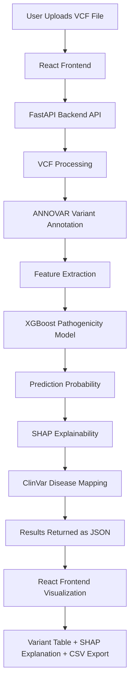

# Team Iris 2.0
**Domain: AI in bioinformatics**  
Topic: **Pathogenic Variant Classification**: An AI-based machine learning model that analyzes genetic variants using publicly available genomic databases to predict whether a mutation is pathogenic or benign, supporting early diagnosis and precision medicine.

## Table of Contents  
- [Overview](#overview)
- [Key Features](#key-features)
- [System Architecture](#system-architecture)
- [Tech Stack](#tech-stack)
- [ML Model](#ml-model)
- [Installation](#installation)
- [Usage](#usage)

---
## Overview

Genomic sequencing generates thousands of variants, but identifying those that contribute to disease is challenging. This project automates variant interpretation by combining variant annotation, machine learning and explainable AI.  
The platform allows users to upload a VCF (Variant call format) file, processes it through ANNOVAR annotation pipelines and predicts the pathogenicity of each variant. The system also displays feature importance explanations and ClinVar disease associations to help interpret predictions.

---
## Key Features
- Upload VCF files for variant analysis
- Automated ANNOVAR annotation pipeline
- Machine Learning classification using XGBoost
- Explainable AI (SHAP) for feature contribution analysis
- ClinVar-based disease association display for pathogenic variants
- Interactive variant table with expandable explanations
- Confidence score for each prediction
- CSV export of results

---
## System Architecture


---
## Tech Stack
- **Backend**
    - Python
    - FastAPI
    - XGBoost
    - SHAP
    - Pandas / NumPy
    - ANNOVAR  
- **Frontend**
    - React.js
    - CSS
- **Data Sources for ANNOVAR**
    - clinvar_20250721
    - gnomad211_exome
    - dbNSFP30a
    - RefGene

---
## ML Model
The pathogenicity prediction model is based on XGBoost, trained using functional annotation features derived from variant databases.  
**Key Features Used**
- CADD Score
- SIFT Score
- PolyPhen Score
- gnomAD Allele Frequency
- GERP++ Conservation Score
- Variant consequence (synonymous, missense, stopgain, etc.)  

The model outputs a probability of pathogenicity, which is converted into:
- Pathogenic
- Benign  
- Uncertain

Predictions are accompanied by confidence scores and SHAP explanations.

---
## Installation
```bash
# Clone repo
git clone https://github.com/dhruthiaithal/Iris_2.0_Pathogen_variant_classification
cd Iris_2.0_Pathogen_variant_classification

# Install backend dependencies
cd backend
pip install -r requirements.txt

# Install frontend dependencies
cd frontend
npm install

# Start backend (FastAPI)
uvicorn app:app --reload #Backend runs at http://127.0.0.1:8000

# Start frontend server
npm run dev #Runs at http://localhost:5173
```

---
## Usage
1. Open the web interface
2. Upload a VCF file
3. Click Analyze Variants
4. The system will-
    - Annotate variants using ANNOVAR
    - Run the ML model
    - Display predictions in a table
5. Click a variant to view SHAP explanations and associated ClinVar diseases
6. Results can be downloaded as a CSV file